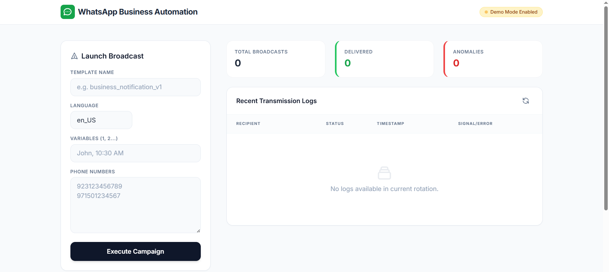
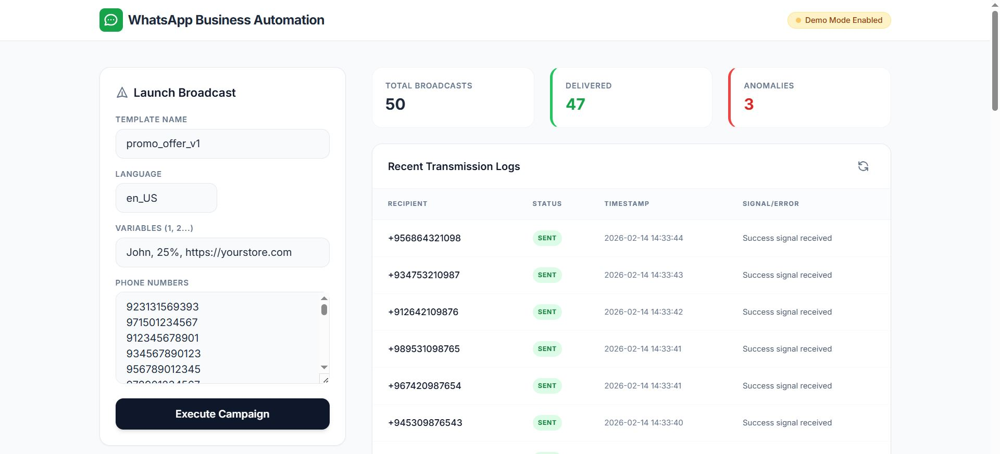

# WhatsApp Business Automation Engine

A high-performance, professional-grade WhatsApp broadcast system built for modern businesses. This engine leverages the **Meta WhatsApp Cloud API** to deliver template-based notifications, marketing broadcasts, and transactional signals at scale.

| Before Run | After Run |
| :---: | :---: |
|  |  |
## 🌟 Key Pillars
- **Transactional Precision**: Designed for official business visits, notifications, and alerts.
- **SaaS-Grade UI**: A clean, responsive dashboard built with Tailwind CSS and Inter typography.
- **Enterprise Ready**: Full separation of concerns (Core, Services, DB) for professional scalability.
- **Risk-Free Demo**: Built-in **Demo Mode** allows for full UI/UX testing without requiring Meta API credentials.

## 🛠 Tech Stack
- **Engine**: FastAPI (High-performance Python)
- **Persistence**: SQLite with SQLAlchemy ORM
- **Interface**: HTML5 / Tailwind CSS / Vanilla JS (Zero-dependency frontend)
- **Integration**: Direct Meta Cloud API (v19.0)

## 📁 Architecture
- `app/core/`: Application configuration and business logic (Demo Mode toggles).
- `app/db/`: Database models and connection management.
- `app/services/`: External integrations (WhatsApp Sender).
- `app/templates/` & `app/static/`: Redesigned SaaS-style interface.

## ⚙️ Project Setup

1. **Environment Preparation**:
   ```bash
   pip install -r app/requirements.txt
   ```

2. **Configuration**:
   - Create a `.env` file based on `.env.example`.
   - **Demo Mode**: Set `DEMO_MODE=true` to simulate broadcasts.
   - **Production**: Set `DEMO_MODE=false` and provide `META_ACCESS_TOKEN`, `PHONE_NUMBER_ID`, etc.

3. **Execution**:
   ```bash
   uvicorn app.main:app --reload
   ```

## 🧪 Demo Mode (Showcase)
When `DEMO_MODE` is active, the system simulates real WhatsApp API behavior:
- **Latent Delivery**: Mimics network delays for a realistic processing feel.
- **Randomized Signals**: Generates both successful deliveries and realistic API errors.
- **Audit Logs**: Persistence of simulated responses for verification.

## 🔒 Compliance & Reliability
This project strictly follows WhatsApp Business API policies. It exclusively supports **Message Templates (HSM)** to ensure 100% deliverability and compliance with Meta's anti-spam regulations.

---

## 🤝 Let's Connect

If you found this template helpful or want to discuss AI systems, feel free to reach out:

- 📧 **Email**: [hassanaiengineer@gmail.com](mailto:hassanaiengineer@gmail.com)
- 🔗 **LinkedIn**: [Hassan Khan](https://www.linkedin.com/in/hassan-khan-4961b722b/)

